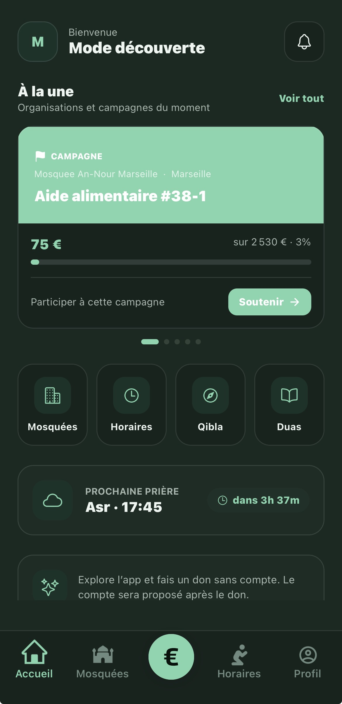
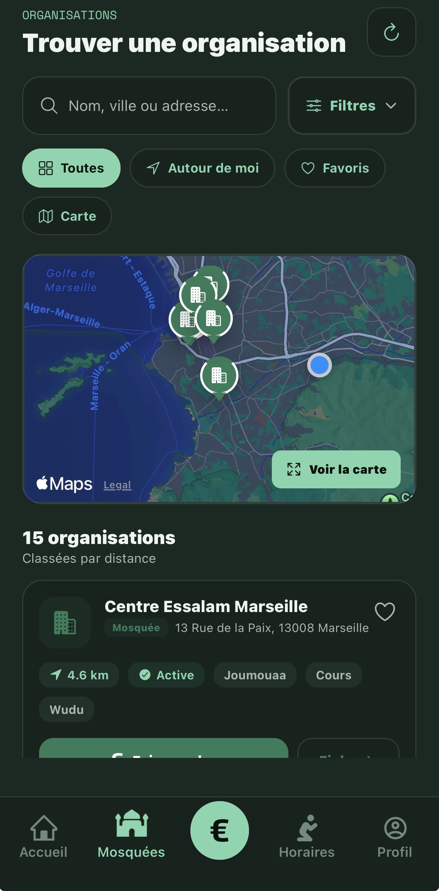
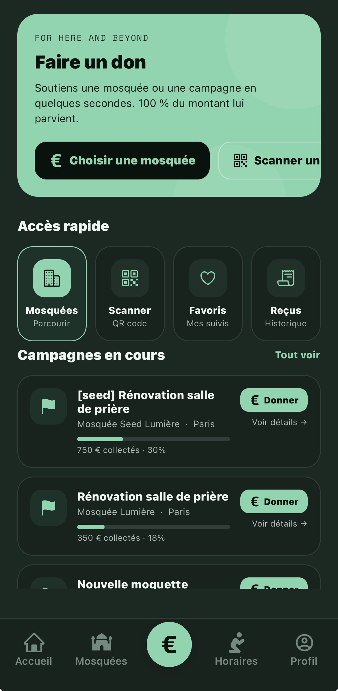
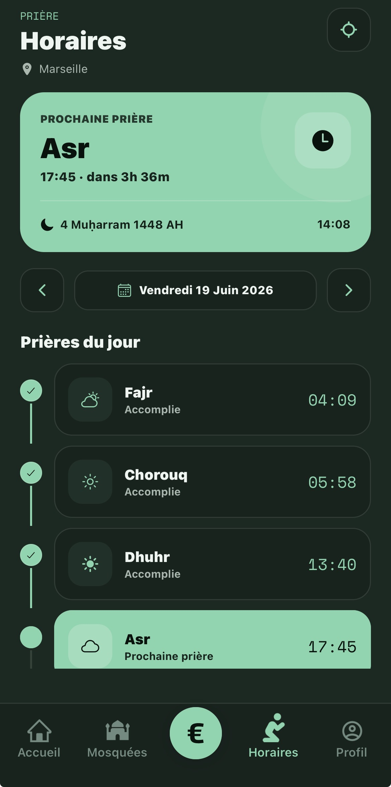
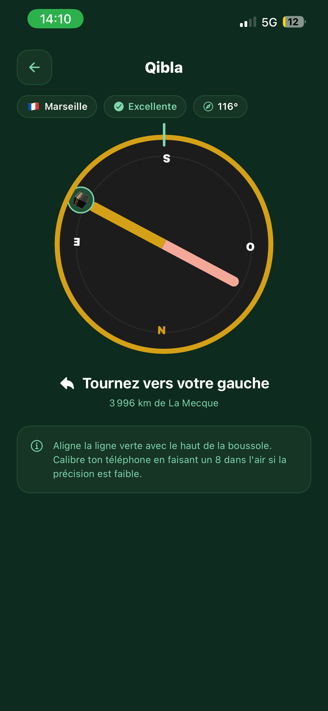
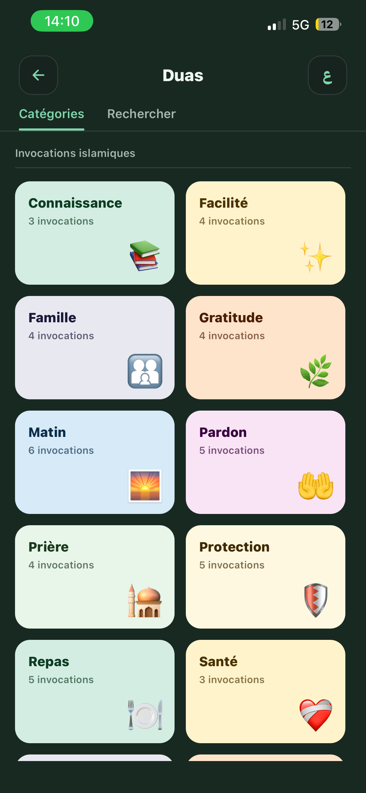
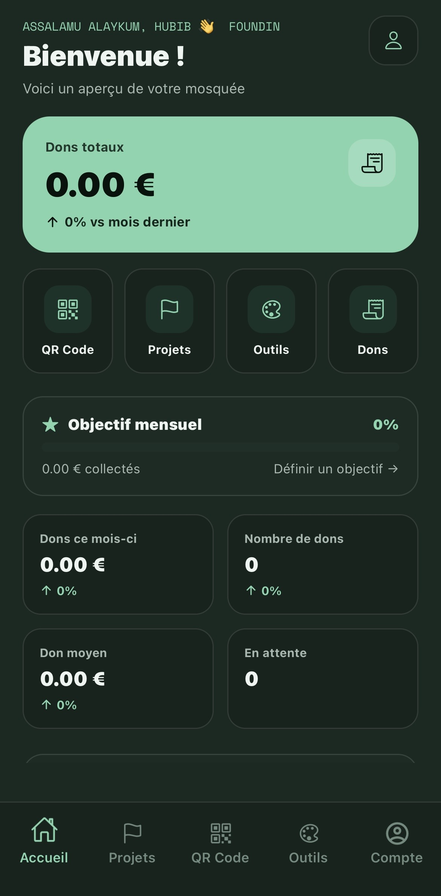
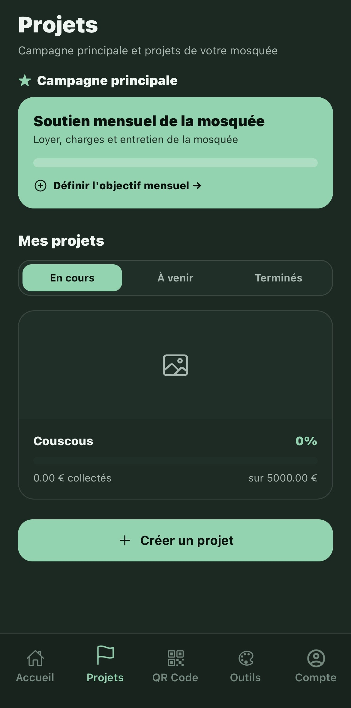
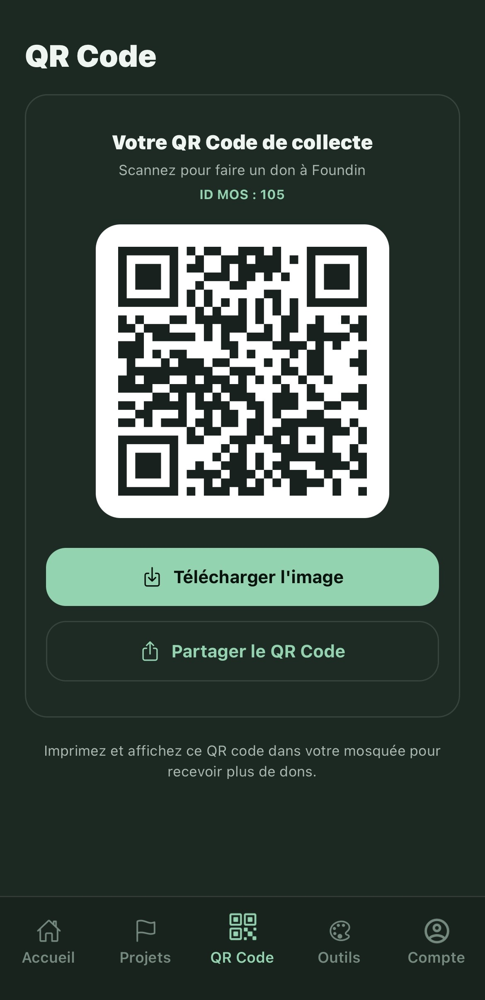
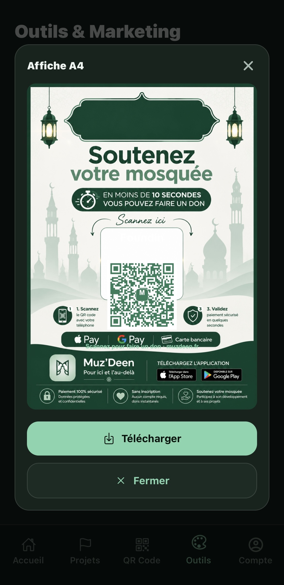

# Muz'Deen — Landing Page

**Pour ici et l'au-delà.**

La plateforme qui digitalise les dons des organisations musulmanes — mosquées, associations de cours de Coran, associations musulmanes, humanitaires et culturelles. Donner en quelques secondes, gérer mieux, rendre des comptes en toute transparence.

---

## 📱 Aperçu de l'application

### Côté donateur

<table>
  <tr>
    <td align="center"> <b>Accueil</b></td>
    <td align="center"> <b>Fiche mosquée</b></td>
    <td align="center"> <b>Don</b></td>
  </tr>
  <tr>
    <td align="center"> <b>Horaires</b></td>
    <td align="center"> <b>Qibla</b></td>
    <td align="center"> <b>Duaa</b></td>
  </tr>
</table>

### Espace manager (organisations)

<table>
  <tr>
    <td align="center"> <b>Tableau de bord</b></td>
    <td align="center"> <b>Projets</b></td>
    <td align="center"> <b>QR codes</b></td>
    <td align="center"> <b>Affiches</b></td>
  </tr>
</table>
---
## 📨 Formulaire de démo

Le formulaire affiche un état de succès côté client. Aucun backend n'est encore branché.

Intégrations futures possibles : route API Next.js, Resend, CRM, notification email interne.

---
## ⚖️ Légal

Pages `/privacy` (politique de confidentialité) et `/terms` (mentions légales) basées sur les modèles légaux du projet — **à faire relire par un professionnel du droit avant mise en production**.

© Muz'Deen — Pour ici et l'au-delà.

